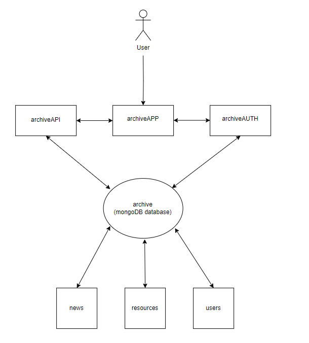
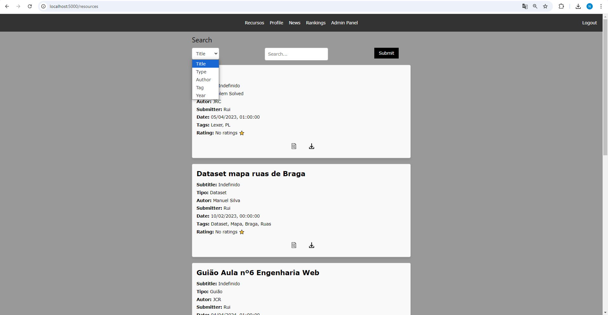
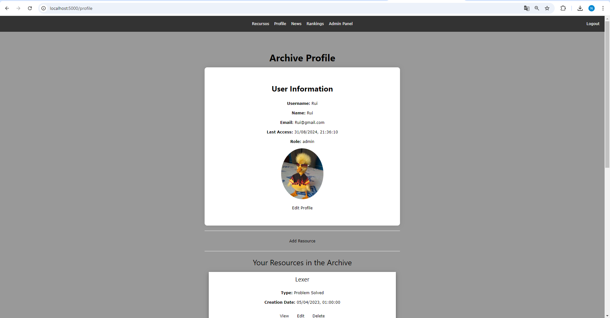
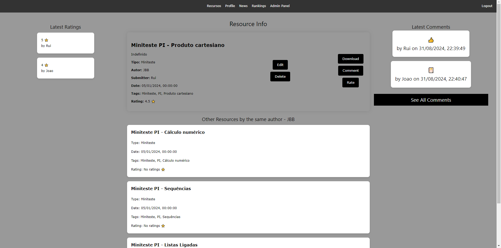
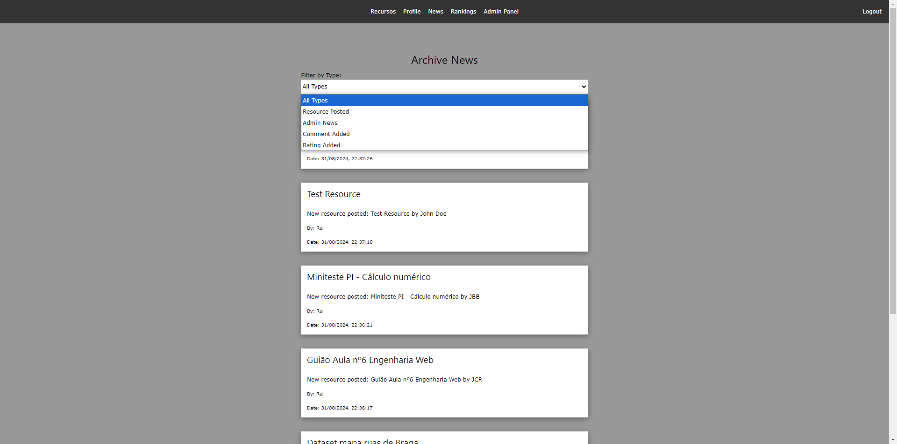
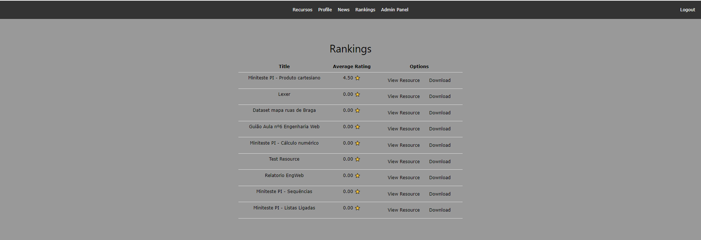
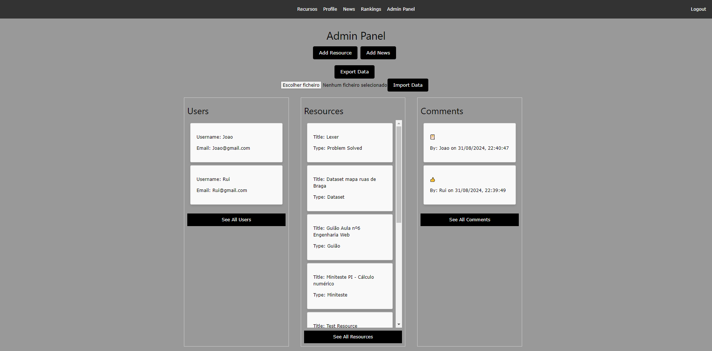
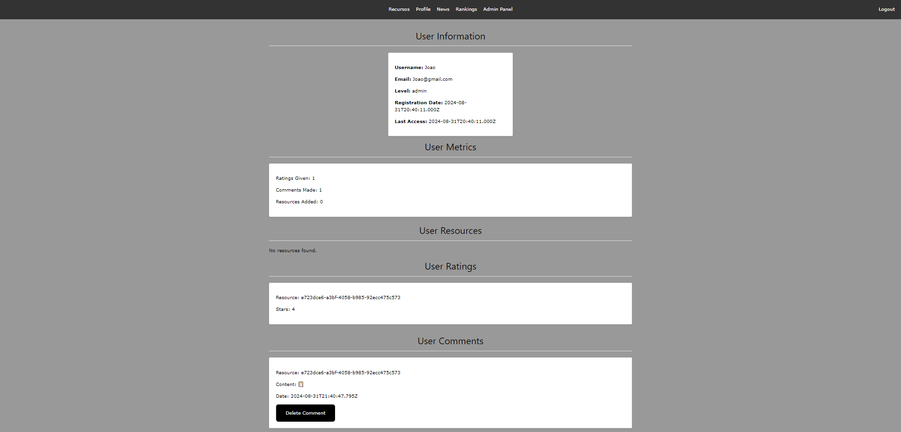

# Projeto Engenharia Web 2024 - Plataforma de Gestão e Disponibilização de Recursos Educativos

## Grupo 50
- Rui Pedro Vaz Cerqueira - a100537
- Guilherme José Araújo Rio - a100898

## Introdução

Para o trabalho prático de Engenharia Web, decidimos escolher a proposta acerca de uma plataforma de gestão e disponibilização de recursos educativos.

O objetivo para esta proposta era desenvolver uma plataforma para disponibilização de recursos educativos. O modelo utilizado foi o OASIS (Open Archival Information System).

No relatório vamos abordar a estrutura da aplicação, como são armazenados e geridos os dados, e as funcionalidades implementadas na plataforma.

## Arquitetura da Plataforma

Para melhor estruturar o projeto construimos 3 servidores, o archiveAPP, archiveAPI e o archiveAUTH.

## Esquema

  

### archiveAPI

O archiveAPI é o servidor responsável por guardar a informação sobre os recursos e as notícias da plataforma.

É responsável por inserir, editar, listar e remover recursos e notícias na base de dados, a qual inclui apenas 2 coleções, uma que guarda tudo relativo a recursos e outra que faz o mesmo para as notícias.

### archiveAPP

O archiveAPP é o servidor que conecta todas as componentes e é também com este que o utilizador interage.

Este trata de todos os pedidos efetuados pelo utilizador, pois é o único com que o mesmo interage, fazendo então a comunicação com o archiveAPI e archiveAUTH para responder ao utilizador.

Respetivamente efetua pedidos ao archiveAUTH quando necessita de informação relativa aos utilizadores e efetua pedidos ao archiveAPI quando necessita de informação relativa aos recursos ou news da plataforma.

### archiveAUTH

O archiveAUTH é responsavel por guardar/gerir a informação sobre os utilizadores.

O servidor gera um jwt para cada user que efetua login na plataforma. O token é gerado e passado como resposta ao achiveAPP, sendo depois utilizado para o servidor verificar o cliente ( o seu nivel, username, etc ).

## Dados

Os dados são guardados numa base de dados não relacional recorrendo ao MongoDB. Utilizamos também o file system para guardar os recursos e fotos de perfil dos utilizadores.
O nome da base de dados é archive, e contém 3 coleções:
- resources
- users
- news

### Resources
Coleção que guarda a informação relativa aos recursos.

- **_id**: Identificador único para o recurso, gerado com uuidv4.
- **type**: String para o tipo do recurso.
- **title**: String para o título do recurso.
- **subtitle**: String para subtítulo do recurso.
- **year**: Número para ano de publicação.
- **creationDate**: data de criação do recurso.
- **registrationDate**: data de registro do recurso.
- **author**: String que representa o autor do recurso.
- **submitter**: String que representa o remetente do recurso.
- **visibility**: String que indica a visibilidade do recurso.
- **tags**: Vetor de Strings que representam as tags associadas ao recurso.
- **comments**: Vetor de objetos de comentário, cada um contendo:
    - **content**: String representando o conteúdo do comentário.
    - **user**: String representando o usuário que fez o comentário.
    - **postDate**: Data representando a data em que o comentário foi publicado.
    - **id**: String representando o id do recurso.
    - **commentID**: String representando um identificador único para o comentário.
- **rankings**: Vetor de objetos de ranking, cada um contendo:
    - **user**: String representando o usuário que fez o ranking.
    - **stars**: Número representando o rating dado pelo usuário.

### News
Coleção que guarda a informação relativa às noticias

- **title** - String para o titulo da notícia
- **content** - String com o conteudo da notícia
- **date** - data da notícia
- **type** - String com o tipo da notícia (post de recursos, rating, comentário ou criada por admin)
- **idResource** - String com o uid do recurso, só necessário se a notícia for relacionada a um recurso.

### Users
Coleção que guarda a informação relativa aos utilizadores

- **username** - String que contém o identificador único escolhido pelo utilizador no registo
- **name** - String que representa o nome do utilizador
- **email** - String que representa o email do utilizador
- **password** - String que guarda a password do utilizador
- **level** - String que representa o nivel do utilizador (producer, consumer, admin)
- **registrationDate** - Data de registo
- **lastAcess** - Data do último acesso do utilizador ao sistema

# Funcionalidades implementadas

Vamos começar por fazer um resumo das funcionalidades para recursos, notícias e utilizadores e depois iremos falar das routes do sistema.

### Recursos
- Adição de recursos
- Edição de recursos
- Eliminação de recursos
- Visualizar recursos
- Download de recursos
- Comentar recursos
- Avaliar recursos
- Eliminar Comentários (administradores)

Na adição de recursos efetuamos uma verificação do upload realizado. Para isso verificamos se foi entregue em zip e se contém os ficheiros manifest e resource-data.json. Se esses ficheiros forem validados e não exister conteúdo extra no zip, o recurso é inserido.

### News

Para as notícias existem 3 tipos:
- **recurso**: esta notícia é gerada automaticamente quando um recurso é adicionado á plataforma.
- **comment**: esta notícia é gerada quando um utilizador comenta um recurso.
- **rating**: esta notícia é gerada quando um utilizador avalia um recurso da plataforma.
- **admin**: esta notícia é criada por um administrador no seu admin panel.

### Users

Os utilizadores podem registar-se e efetuar o login na plataforma, e podem também editar o seu perfil e adicionar uma foto de perfil.

## Páginas

### /registo  /login
Páginas onde o utilizador se irá registar ou efetuar o login e lhe serão pedidos os dados necessários.

### /resources
Nesta página estão listados todos os recursos públicos do sistema. Cada recurso está numa "card" na qual o utilizador pode clicar para ir para a página do recurso.
A página contém também uma search bar, que funciona por filtros, ou seja, o utilizador seleciona um dos filtros disponiveis e insere o que pretende consultar nesse contexto.

### /resources/:id
Esta página lista tudo relacionado a um recurso, contém também todos os ratings e 5 dos comentários feitos no recurs. Se o utilizador pretender ver todos os comentários feitos no recurso terá um botão que o levará a essa página.
Contém também caixas com informação a recursos feitos pelo mesmo autor do recurso que está a ser visualizado.
No caso de ser um administrador/dono do recurso, existirá também a opção para remover ou editar o recurso.

### /news
Contém todas as notícias do sistema. Se o utilizador pretender pode clicar na noticia e irá ser redirecionado para a página do recurso ao qual a notícia se refere.
Contém também uma maneira de filtrar pelos diferentes tipos de notícias.

### /profile
Esta página contém toda a informação do utilizador, assim como um botão para editar o seu perfil. Contém também o botão onde o utilizador pode clicar para adicionar um recurso, e em baixo mostra todos os recursos do utilizador no archive.

### /resources/add
Página para adicionar um recurso. Se o upload falhar irá mostrar ao utilizador o que estava errado com o upload.

### /rankings 
Contém uma tabela com os recursos listados e os seus average rating de modo decrescente, assim como uma opção para visualizar ou efetuar download do recurso.

### /adminpanel (admin only)

Esta página contém várias funcionalidades:
- Adicionar um recurso
- Adicionar uma notícia
- Exportar os dados (backup)
- Importar os dados
- Visualizar todos os utilizadores
- Visualizar todos os recursos
- Visualizar todos os comentários

Caso selecione visualizar todos os comentários, irão ser mostrados do mais recente para o mais antigo, onde o administrador poderá remover o comentário

Caso selecione visualizar todos os utilizadores, irão ser mostrados todos os utilizadores do sistema. O administrador poderá ter a opção de visualizar as informações do utilizador ou editar o utilizador.
Se pretender visualizar a informação do utlizador, será redirecionado para uma página similar ao perfil, onde poderá visualizar as informações do utilizador, as suas métricas, os seus recursos, os seus comentários e os ratings que o mesmo atribuiu.

# Conclusão

Achamos que cumprimos todos os objetivos pedidos para esta proposta, assim como os que nós pretendíamos adicionar, apesar de ainda termos algumas melhorias que poderíamos realizar.

# Demonstração Páginas

### Home page

  

### Profile page

### Resource page

### News page

### Rankings page

### Admin Panel page

### Admin User View page
